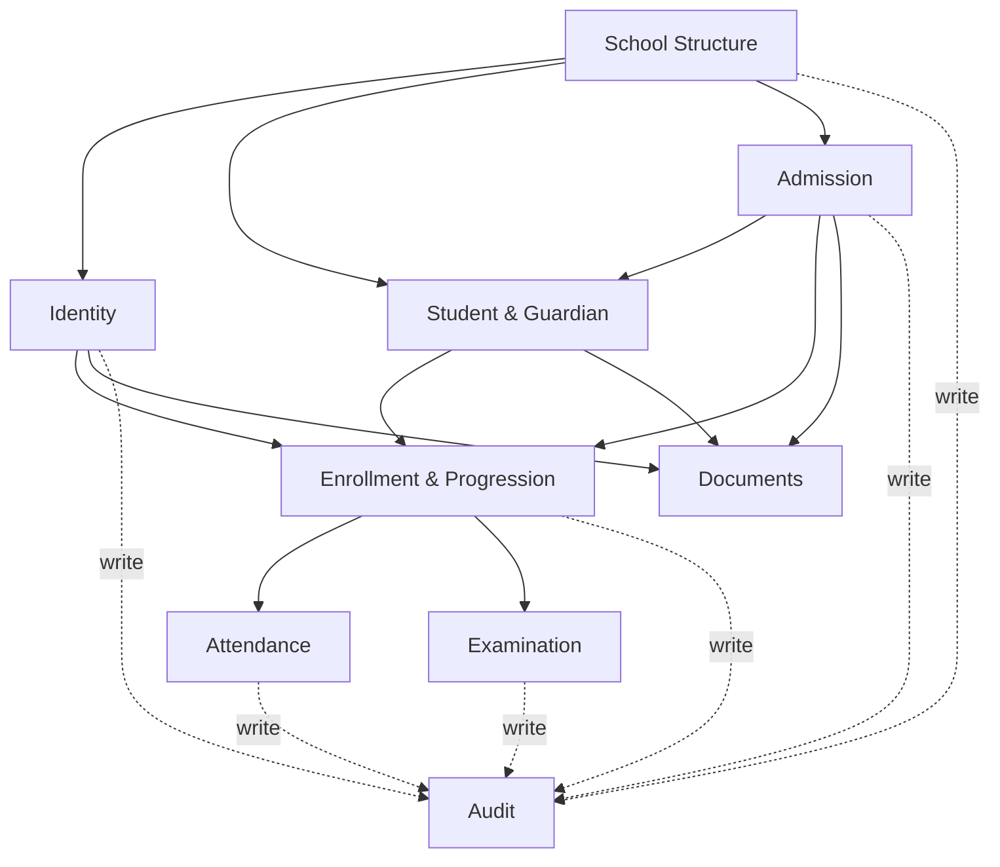

# API Boundaries

**Purpose:** The logical module boundaries for the future internal API surface, and where a future external/public API begins — one level of abstraction above [DOMAIN_MODEL.md](./DOMAIN_MODEL.md)'s entities, one level below actual route implementation. **No API route is created by this document** — see [README.md](./README.md). Operation names below (`admitStudent`, `markAttendance`, etc.) are logical capabilities, not literal endpoint paths; the real implementation task decides whether these become Server Actions, Route Handlers, or both, per [ARCHITECTURE.md § 2](../ARCHITECTURE.md#2-folder-structure).

---

## 1. Internal vs. External — Restated

[PRODUCT_ARCHITECTURE.md § 11](../PRODUCT_ARCHITECTURE.md#11-future-api-layer) already draws this line at the product-architecture level; this document applies it to the domain model specifically:

- **Internal API** — consumed only by this Next.js app's own Server Components/Server Actions, session-cookie-authenticated, evolves freely alongside the frontend. Every boundary in § 2 below is, today, an internal boundary only.
- **External/public API** — a distinct future layer (third-party integrations, a future mobile app), separately authenticated and versioned. **Not designed here** — named only where a boundary below would need to change shape to eventually support it (§ 4).

## 2. Logical Module Boundaries

One module per [DOMAIN_MODEL.md § 2](./DOMAIN_MODEL.md#2-bounded-contexts) bounded context. Each module owns its entities' mutations; other modules depend on it through these logical operations, not by reaching into its tables directly — the same discipline [AI_RULES.md § 2](../AI_RULES.md#2-code--component-discipline) already requires for shared logic in `/lib`.

### 2.1 School Structure Module

- **Owns:** `School`, `AcademicYear`, `Class`, `Section`, `Subject`, `ClassSubject`
- **Key operations:** `getCurrentAcademicYear()`, `rolloverAcademicYear()`, `createSection()`, `updateClassSubjects()`
- **Consumed by:** every other module (nearly all entities scope through `AcademicYear`/`Class`/`Section`)

### 2.2 Identity Module

- **Owns:** `User`, `Teacher`, `TeacherQualification`
- **Key operations:** `createTeacherAccount()`, `assignRole()`, `deactivateUser()`, `updateTeacherProfile()`
- **Consumed by:** Enrollment/Progression Module (`TeacherAssignment` references `Teacher`), Attendance Module, Examination Module

### 2.3 Student & Guardian Module

- **Owns:** `Student`, `Guardian`, `StudentGuardian`
- **Key operations:** `createStudent()`, `linkGuardian()`, `updateStudentStatus()`
- **Consumed by:** Admission Module (creates `Student` on confirmation), Enrollment/Progression Module

### 2.4 Admission Module

- **Owns:** `AdmissionEnquiry`, `AdmissionApplication`, `RteDetails`, `DocumentRecord` _(shared utility, see § 2.8)_
- **Key operations:** `submitEnquiry()`, `convertToApplication()`, `attachRteDetails()`, `confirmAdmission()` — the last of which calls into § 2.3 and § 2.5 to create the resulting `Student` + `Enrollment`
- **Consumed by:** Guest-facing enquiry form (public, unauthenticated — the one genuinely public write in this whole model, per [PRD § 6.1](../PRODUCT_REQUIREMENTS.md#61-guest--admission-enquiry))

### 2.5 Enrollment & Progression Module

- **Owns:** `Enrollment`, `TeacherAssignment`, `PromotionRecord`, `TransferCertificate`
- **Key operations:** `createEnrollment()`, `assignTeacher()`, `decidePromotion()`, `issueTransferCertificate()`
- **Consumed by:** Attendance Module and Examination Module (both key off `Enrollment`)

### 2.6 Attendance Module

- **Owns:** `AttendanceSession`, `AttendanceRecord`
- **Key operations:** `openAttendanceSession()`, `submitAttendance()`, `correctAttendanceRecord()`, `getAttendanceSummary()`
- **Consumes:** Enrollment & Progression Module (validates the caller's `TeacherAssignment` before allowing a write — see [PERMISSION_MATRIX.md § 5](./PERMISSION_MATRIX.md#5-attendance))

### 2.7 Examination Module

- **Owns:** `ExamTerm`, `Examination`, `ExamSubjectSchedule`, `GradeScale`, `MarksRecord`, `ReportCard`
- **Key operations:** `scheduleExamination()`, `submitMarks()`, `correctMarksRecord()`, `generateReportCard()`, `getClassResultSummary()`
- **Consumes:** Enrollment & Progression Module (same `TeacherAssignment` check pattern as Attendance)

### 2.8 Shared Utility: Documents

- **Owns:** `DocumentRecord`
- **Key operations:** `uploadDocument(ownerType, ownerId)`, `getDocumentsFor(ownerType, ownerId)`
- **Consumed by:** Admission Module, Identity Module (`TeacherQualification` certificates), Student & Guardian Module — genuinely shared, per [DATABASE_SCHEMA.md § 9](./DATABASE_SCHEMA.md#9-documentrecord--a-note-on-the-polymorphic-reference)'s polymorphic-reference tradeoff

### 2.9 Cross-Cutting: Audit

- **Owns:** `AuditLog`
- **Key operations:** `recordAuditEntry()` — called internally by every other module's mutations, never called directly by a UI action
- **Consumed by:** every module (write-only from their side); read by Admin-facing audit views only

## 3. Module Dependency Graph

No circular dependency exists between modules — a deliberate check, since a real implementation with circular module imports is a maintainability risk [AI_RULES.md § 2](../AI_RULES.md#2-code--component-discipline)'s "no duplicate logic" discipline would flag immediately.

## 4. Where the External API Boundary Would Eventually Sit

Not designed — named per [PRODUCT_ARCHITECTURE.md § 11](../PRODUCT_ARCHITECTURE.md#11-future-api-layer)'s own framing, applied concretely:

| Future consumer                                                                           | Would likely need read access to                                                 | Would likely need write access to                                                                       |
| ----------------------------------------------------------------------------------------- | -------------------------------------------------------------------------------- | ------------------------------------------------------------------------------------------------------- |
| Mobile app (future)                                                                       | Attendance, Examination, Enrollment modules (student/teacher-facing views)       | Attendance, Examination (same modules Teachers already write to internally)                             |
| Parent Portal (future, if built as a separate surface rather than a role within this app) | Enrollment, Attendance, Examination modules, scoped to linked children           | None expected — read-only per [PRODUCT_ARCHITECTURE.md § 6](../PRODUCT_ARCHITECTURE.md#6-parent-portal) |
| Government/UDISE reporting integration (future)                                           | Student, Enrollment, Identity modules (structured export)                        | None — one-way export                                                                                   |
| SMS/notification provider (future)                                                        | Subscribes to events in [EVENT_MODEL.md](./EVENT_MODEL.md), not raw entity reads | None                                                                                                    |

Each of these remains gated behind its own future scoped decision and, where it constitutes a new module (Fee, Transport), the [Module Approval Process](../PROJECT_GUARDRAILS.md#2-module-approval-process) — this table exists so that when one of those decisions is actually made, the module boundaries in § 2 don't need to be redrawn from scratch to accommodate it.
