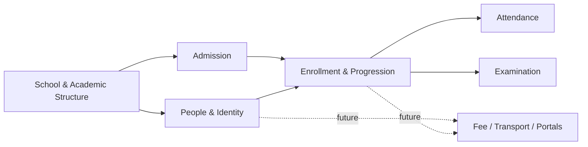

# Domain Model

**Purpose:** The complete conceptual model of every entity the School Operating System's Admin/Teacher surfaces will eventually manage — what it is, who owns it, how it relates to everything else, and what it will need once a second tenant or a future module exists. Field-by-field detail lives in [DATA_DICTIONARY.md](./DATA_DICTIONARY.md); this document stays conceptual, one level up.

---

## 1. Scope & Assumptions

Designed for **independent (unaffiliated-chain) Indian schools, Nursery through Class 8**, matching [PRODUCT_VISION.md § 3](../PRODUCT_VISION.md#3-target-audience)'s target audience — not exclusively CBSE, not exclusively Rajasthan. Three assumptions this model deliberately does **not** make, because doing so would fit Pant Public School at the cost of the other ~80% of schools this platform is meant to eventually serve:

| Assumption avoided                            | Why                                                                                                                                                                                                                                                | How the model handles it instead                                                                                                            |
| --------------------------------------------- | -------------------------------------------------------------------------------------------------------------------------------------------------------------------------------------------------------------------------------------------------- | ------------------------------------------------------------------------------------------------------------------------------------------- |
| "The board is always CBSE"                    | ICSE, various State Boards, and provisionally-unaffiliated schools are all common for independent K-8 schools; board mostly affects syllabus/recognition, not exam mechanics at this age range (see [README.md § 4](./README.md#4-research-basis)) | `School.affiliationBoard` is a configurable value; `GradeScale`/`Examination` are fully school-defined, referencing no board-specific logic |
| "The state is always Rajasthan"               | Admission age cutoffs, PTR norms, and detention/no-detention policy are state-level decisions under the RTE Amendment Act 2019, and differ                                                                                                         | Every state-variable fact (age cutoffs, promotion policy) is `School`/`AcademicYear`-level configuration, not a constant                    |
| "A student's class is a single mutable field" | A student's class changes every academic year, and past years' class/section/roll-number must remain queryable (report cards, TCs, promotion history all reference a specific past year)                                                           | `Enrollment` is a first-class entity, one row per `(Student, AcademicYear)` — see § 4.10                                                    |

## 2. Bounded Contexts

Seven contexts group the ~29 entities that follow. Each context maps to a natural future module boundary — see [API_BOUNDARIES.md](./API_BOUNDARIES.md) for how these become logical API surfaces.

| Context                     | Owns                                                                                        | V1 Scope?                                                                                                                |
| --------------------------- | ------------------------------------------------------------------------------------------- | ------------------------------------------------------------------------------------------------------------------------ |
| School & Academic Structure | `School`, `AcademicYear`, `Class`, `Section`, `Subject`, `ClassSubject`                     | Yes ([PRD § 3.2](../PRODUCT_REQUIREMENTS.md#32-admin), School Settings)                                                  |
| People & Identity           | `User`, `Student`, `Guardian`, `StudentGuardian`, `Teacher`, `TeacherQualification`         | Yes                                                                                                                      |
| Admission                   | `AdmissionEnquiry`, `AdmissionApplication`, `RteDetails`, `DocumentRecord`                  | Yes (enquiry form is P0; application review is Admin)                                                                    |
| Enrollment & Progression    | `Enrollment`, `TeacherAssignment`, `PromotionRecord`, `TransferCertificate`                 | Yes                                                                                                                      |
| Attendance                  | `AttendanceSession`, `AttendanceRecord`                                                     | Yes                                                                                                                      |
| Examination                 | `ExamTerm`, `Examination`, `ExamSubjectSchedule`, `GradeScale`, `MarksRecord`, `ReportCard` | Yes                                                                                                                      |
| System / Cross-Cutting      | `AuditLog`                                                                                  | Yes (implicit, per [ARCHITECTURE.md § 7](../ARCHITECTURE.md#7-security-principles))                                      |
| **Future — not V1**         | Fee, Transport, Parent Portal, Student Portal entities                                      | **No — Module Approval Process required** ([README.md § 5](./README.md#5-future-integration-points--named-not-designed)) |

---

## 3. School & Academic Structure

### 3.1 School

- **Purpose:** The tenant root. Everything school-owned hangs off this, directly or transitively.
- **Owner:** Admin (School Settings, per [PRD § 3.2](../PRODUCT_REQUIREMENTS.md#32-admin)).
- **Relationships:** Parent of every other school-owned entity via `schoolId`.
- **Future dependencies:** Becomes the `Tenant` record's counterpart once [Epic H](../ROADMAP_V2.md#epic-h--platform) formalizes multi-tenancy — see [PRODUCT_ARCHITECTURE.md § 2](../PRODUCT_ARCHITECTURE.md#2-future-architecture) step 3.
- **Audit requirements:** Full change history — school identity/settings changes are rare and consequential (e.g., changing the promotion policy mid-year).
- **Soft delete:** N/A in V1 — a school is never "deleted" while it's the one tenant; becomes relevant only at Epic H (school offboarding).
- **Configuration vs. database:** Today, `src/config/school.ts`'s static object _is_ the pre-database equivalent. Once built, `School` is the database's single seed-data row — see [README.md § 6](./README.md#6-configuration-vs-database--reconciling-with-configuration_guidemd).

### 3.2 Class

- **Purpose:** A grade/standard — Nursery, LKG, UKG, Class 1 through Class 8 for this school's scope. Also commonly called "Grade" or "Standard" regionally; `Class` is the canonical name here.
- **Owner:** Admin (School Settings).
- **Relationships:** Belongs to `School`; has many `Section`s per `AcademicYear`; has many `ClassSubject`s.
- **Future dependencies:** Fee slabs (future Fee module) are typically defined per class.
- **Audit requirements:** Standard (who added/renamed a class, when).
- **Soft delete:** Yes — a class is never hard-deleted once any `Enrollment` references it (historical report cards/TCs must remain resolvable).
- **Configuration:** The _display list_ of classes offered is `src/config/school.ts`'s `SCHOOL.classes` today; becomes seed data for this table (see [README.md § 6](./README.md#6-configuration-vs-database--reconciling-with-configuration_guidemd)). Sequencing (Nursery < LKG < UKG < Class 1 < ... < Class 8) is a school-configurable ordinal, not hardcoded, since a school's naming for pre-primary years varies (some use "Playgroup" before Nursery, "Pre-Primary 1/2" instead of LKG/UKG).

### 3.3 Section

- **Purpose:** A division within a class for a given academic year — e.g., "6-A". Where students are actually grouped for attendance and a home-room teacher.
- **Owner:** Admin.
- **Relationships:** Belongs to `Class` and `AcademicYear`; has one Class Teacher (`TeacherAssignment` with `isClassTeacher = true`); has many `Enrollment`s.
- **Future dependencies:** Transport route grouping (future Transport module) often keys off section/pickup point.
- **Audit requirements:** Standard.
- **Soft delete:** Yes — sections are year-scoped by nature (recreated or renamed each `AcademicYear`), never hard-deleted once enrollments exist.
- **Configuration:** None — genuinely operational data (created by Admin action as enrollment demands, not a deploy-time fact).

### 3.4 Subject

- **Purpose:** A teachable subject — e.g., "Mathematics", "Environmental Studies" (common at primary level), "Science" (from upper-primary).
- **Owner:** Admin.
- **Relationships:** Many-to-many with `Class` via `ClassSubject` (a subject applies only to certain classes — e.g., "EVS" typically stops after Class 5, replaced by Science/Social Studies).
- **Future dependencies:** None identified.
- **Audit requirements:** Standard.
- **Soft delete:** Yes — once `ExamSubjectSchedule`/`MarksRecord` reference it.
- **Configuration:** The subject catalog itself is data (Admin-managed, varies by school's curriculum choices), not code or static config.

### 3.5 ClassSubject

- **Purpose:** Join entity — which subjects apply to which class, for a given academic year (a school may add "Computer Science" starting Class 3 one year, Class 1 the next).
- **Owner:** Admin.
- **Relationships:** `Class` + `Subject` + `AcademicYear`.
- **Future dependencies:** None identified.
- **Audit requirements:** Standard.
- **Soft delete:** Yes.
- **Configuration:** None — operational.

### 3.6 AcademicYear

- **Purpose:** A school session — e.g., "2026–27". The time-boxing dimension nearly every other entity (`Enrollment`, `Examination`, `AttendanceRecord` indirectly via `Enrollment`) is scoped within.
- **Owner:** Admin (School Settings — start month, term structure; see [PRD § 11 Open Product Questions](../PRODUCT_REQUIREMENTS.md#11-open-product-questions)).
- **Relationships:** Parent of `Section`, `ClassSubject`, `Enrollment`, `Examination`.
- **Future dependencies:** Fee schedules (future) are typically academic-year-scoped.
- **Audit requirements:** Standard; exactly one `AcademicYear` should be marked `isCurrent` at a time — a business rule, not a schema constraint alone (see [BUSINESS_RULES.md § 1](./BUSINESS_RULES.md#1-academic-year)).
- **Soft delete:** No — years are never deleted, only closed (`status: Active | Closed`).
- **Configuration:** Start month is configurable (April–March is the overwhelming Indian norm but not universal); term structure (how many `ExamTerm`s) is configurable per year, not hardcoded.

---

## 4. People & Identity

### 4.1 User

- **Purpose:** The authentication identity — email/credentials, role. Distinct from the _profile_ entities (`Teacher`) because a login identity and a person-profile are different concerns; an Admin may have no separate profile entity in V1, while a Teacher always has both a `User` (for login) and a `Teacher` (for the profile/assignment data).
- **Owner:** Admin (creates Teacher accounts, per [PRD § 6.4](../PRODUCT_REQUIREMENTS.md#64-admin--managing-a-new-teacher)); each `User` owns their own profile fields.
- **Relationships:** One-to-one (optional) with `Teacher`. Role: `ADMIN | TEACHER` in V1; `PARENT | STUDENT` reserved, unused, per [D-001](../DECISIONS.md#d-001--three-roles-only-for-version-1).
- **Future dependencies:** Parent Portal/Student Portal would add `PARENT`/`STUDENT` roles here — the enum is the seam; adding a value is cheap, the surfaces behind it are not built. **Future — requires Module Approval Process.**
- **Audit requirements:** Full auth audit trail (login events, role changes) — a security-relevant entity.
- **Soft delete:** Yes (`deactivatedAt`) — never hard-delete a `User` once any action is attributed to them (audit-log integrity).
- **Configuration:** None — genuinely runtime data, and per [ARCHITECTURE.md § 9](../ARCHITECTURE.md#9-open-architectural-questions) depends on the still-open Auth.js provider decision.

### 4.2 Student

- **Purpose:** A child enrolled (or formerly enrolled) at the school. The record that persists across academic years, classes, and sections.
- **Owner:** Admin (create/edit/deactivate, per [PRD § 3.2](../PRODUCT_REQUIREMENTS.md#32-admin)).
- **Relationships:** Has many `Enrollment`s (one per academic year); has many `Guardian`s via `StudentGuardian`; has many `AttendanceRecord`s and `MarksRecord`s (both indirectly, scoped through `Enrollment`); has zero-or-one `AdmissionApplication` (its origin record); has zero-or-one `TransferCertificate` (if withdrawn).
- **Future dependencies:** Fee ledger (future Fee module) keys off `Student`. Parent Portal (future) grants a `Guardian`'s linked `User` read access scoped to their linked `Student`(s).
- **Audit requirements:** Full change history — a student record is a legal/administrative record (name corrections, category changes must be traceable).
- **Soft delete:** Yes (`status: Active | Alumni | TransferredOut | Withdrawn`) — never hard-deleted; a school must be able to produce a former student's records (TC reissue, past report cards) indefinitely.
- **Configuration:** None on the entity itself. `udisePen` (see § 4.2.1 below) is a real, near-universal government-reporting field, not a Pant-Public-School-specific one.

**4.2.1 A note on `udisePen`:** The Permanent Education Number under India's UDISE+ system is assigned once per student and persists across school transfers — the _receiving_ school needs a departing student's PEN to link continuity. This is why it lives on `Student` (survives across enrollments) rather than on `Enrollment` or `TransferCertificate` alone. See [README.md § 4](./README.md#4-research-basis).

### 4.3 Guardian

- **Purpose:** A parent or guardian. Modeled separately from `Student` (not as flat fields on the student record) because one guardian commonly has multiple children at the same school, and a single student can have more than one guardian with different contact roles (father, mother, legal guardian).
- **Owner:** Admin (entered during admission; editable thereafter).
- **Relationships:** Many-to-many with `Student` via `StudentGuardian`.
- **Future dependencies:** Parent Portal (future) authenticates as a `Guardian`-linked `User`. **Future — requires Module Approval Process.**
- **Audit requirements:** Standard (contact-detail changes should be traceable — matters for emergency contact reliability).
- **Soft delete:** Yes.
- **Configuration:** None.

### 4.4 StudentGuardian

- **Purpose:** Join entity carrying the _nature_ of the relationship (Father, Mother, Legal Guardian, Other) and which guardian is the primary contact / authorized for pickup.
- **Owner:** Admin.
- **Relationships:** `Student` + `Guardian` + `relationshipType` + `isPrimaryContact` + `isAuthorizedForPickup`.
- **Future dependencies:** None beyond § 4.3's Parent Portal note.
- **Audit requirements:** Standard — pickup authorization changes are safety-relevant and should be traceable.
- **Soft delete:** Yes (relationship can be revoked without deleting either `Student` or `Guardian`).
- **Configuration:** `relationshipType` values are a fixed, small enum, not school-configurable.

### 4.5 Teacher

- **Purpose:** A member of teaching staff. The profile referenced by class/subject assignment, attendance-marking, and marks-entry actions.
- **Owner:** Admin (create/edit/deactivate, per [PRD § 3.2](../PRODUCT_REQUIREMENTS.md#32-admin)); Teacher owns their own profile edits (per [PRD § 3.3](../PRODUCT_REQUIREMENTS.md#33-teacher)).
- **Relationships:** One-to-one with `User`; has many `TeacherAssignment`s (which classes/subjects/sections, and whether Class Teacher for a section); has many `TeacherQualification`s.
- **Future dependencies:** Payroll (out of scope entirely, not even a future seam worth naming — see [PRD § 4](../PRODUCT_REQUIREMENTS.md#4-out-of-scope)).
- **Audit requirements:** Full change history (assignment changes, deactivation).
- **Soft delete:** Yes (`status: Active | OnLeave | Exited`) — never hard-deleted once any `AttendanceRecord`/`MarksRecord` is attributed to them (audit integrity — "who marked this attendance" must remain answerable even after a teacher leaves).
- **Configuration:** None.

### 4.6 TeacherQualification

- **Purpose:** A teacher's degree/certification records — B.Ed, TET (Teacher Eligibility Test) pass status, subject specialization. Modeled as a child entity (not flat fields) because a teacher may hold multiple qualifications, and RTE-driven compliance reporting (minimum-qualification norms) needs to query this independently of the profile.
- **Owner:** Admin.
- **Relationships:** Belongs to `Teacher`.
- **Future dependencies:** Compliance reporting (future — see [REPORTING_MODEL.md § 5](./REPORTING_MODEL.md#5-future-compliance-reports)).
- **Audit requirements:** Standard.
- **Soft delete:** Yes.
- **Configuration:** Qualification-type list (B.Ed, TET, M.Ed, etc.) is a small reference list, not school-specific configuration.

---

## 5. Admission

### 5.1 AdmissionEnquiry

- **Purpose:** The Guest-submitted enquiry — [PRD § 6.1](../PRODUCT_REQUIREMENTS.md#61-guest--admission-enquiry)'s "student name, class applying for, guardian contact." Pre-account, pre-verification; the lightest-weight record in the whole model.
- **Owner:** Guest (creates it); Admin (triages it into an `AdmissionApplication` or closes it).
- **Relationships:** Zero-or-one resulting `AdmissionApplication`.
- **Future dependencies:** None.
- **Audit requirements:** Standard (spam/duplicate detection needs a timestamp + source IP class of data — a security, not domain, concern, noted here only as a dependency).
- **Soft delete:** Yes (`status: New | Contacted | Converted | Closed`).
- **Configuration:** The exact field list is explicitly an [open product question](../PRODUCT_REQUIREMENTS.md#11-open-product-questions) — not finalized here; this entity's field list in [DATA_DICTIONARY.md](./DATA_DICTIONARY.md) is a reasonable default, flagged as pending School Admin confirmation, consistent with how the Content Readiness Framework handles unconfirmed facts.

### 5.2 AdmissionApplication

- **Purpose:** The formal application once an enquiry is being seriously pursued — documents, category, entrance-interaction (not "exam" — see [BUSINESS_RULES.md § 2](./BUSINESS_RULES.md#2-admission-eligibility)) scheduling, offer status.
- **Owner:** Admin.
- **Relationships:** Originates from zero-or-one `AdmissionEnquiry`; has many `DocumentRecord`s; has zero-or-one `RteDetails`; produces zero-or-one `Student` + `Enrollment` on confirmed admission.
- **Future dependencies:** Admission fee (future Fee module) would attach here.
- **Audit requirements:** Full history — admission decisions (offered/rejected/waitlisted) are administratively sensitive.
- **Soft delete:** Yes (`status: Submitted | UnderReview | OfferMade | DocumentsVerified | Confirmed | Rejected | Withdrawn`).
- **Configuration:** `admissionCategory` values (General, RTE, Management Quota, Staff Ward, Sibling, etc.) are school-configurable, not a fixed enum — categories genuinely vary by school policy.

### 5.3 RteDetails

- **Purpose:** The RTE Section 12(1)(c) 25%-quota-specific fields — income certificate reference, category certificate reference (SC/ST/OBC/EWS, if applicable to the state's RTE rules), the government lottery/draw reference number, and government fee-reimbursement tracking. Modeled as a separate child entity rather than fields on `AdmissionApplication`/`Student` because the overwhelming majority of students never have this data — keeping it on the core tables would mean dozens of always-null columns.
- **Owner:** Admin.
- **Relationships:** Belongs to `AdmissionApplication` (one-to-one, only present when `admissionCategory = RTE`).
- **Future dependencies:** Government reimbursement reconciliation (future — likely part of a future Fee module's scope, not V1).
- **Audit requirements:** Full history — this is compliance-sensitive government-facing data.
- **Soft delete:** No independent soft delete — lifecycle follows the parent `AdmissionApplication`.
- **Configuration:** None — this entity's _existence_ on a given application is itself a fact, not configuration.

### 5.4 DocumentRecord

- **Purpose:** A generic uploaded-document reference (birth certificate, previous school's TC, category certificate, Aadhaar, photograph) — reusable across Admission, Student, and Teacher contexts rather than one bespoke document table per context.
- **Owner:** Whoever uploads it (Admin, on behalf of the applicant/guardian in nearly all V1 cases).
- **Relationships:** Polymorphic-style reference — `ownerType: Student | Teacher | AdmissionApplication` + `ownerId`. See [DATABASE_SCHEMA.md § 9](./DATABASE_SCHEMA.md#9-documentrecord--a-note-on-the-polymorphic-reference) for the tradeoff this shape accepts.
- **Future dependencies:** None beyond its own storage (Cloudinary, per [NFR-6](../PRODUCT_REQUIREMENTS.md#9-non-functional-requirements)).
- **Audit requirements:** Standard (who uploaded, when; document _replacement_ — not silent overwrite — should be the norm, so a prior verification isn't invalidated invisibly).
- **Soft delete:** Yes.
- **Configuration:** Required-document-type list per admission category is school-configurable.

---

## 6. Enrollment & Progression

### 6.1 Enrollment

- **Purpose:** The record of a `Student` being in a specific `Class`/`Section`, with a specific roll number, for a specific `AcademicYear`. This is the entity that makes "what class was this student in last year" a real, first-class query instead of a guess — see § 1's third assumption-avoided.
- **Owner:** Admin (created at admission confirmation; updated at promotion).
- **Relationships:** `Student` + `AcademicYear` + `Section` (which implies `Class`); parent of that year's `AttendanceRecord`s (via `AttendanceSession`) and `MarksRecord`s (via `Examination`).
- **Future dependencies:** Fee invoicing (future) is naturally academic-year-and-class scoped, i.e., `Enrollment`-scoped.
- **Audit requirements:** Full history — mid-year section transfers, roll-number corrections.
- **Soft delete:** No hard delete — an `Enrollment` row, once created, is permanent history; a promotion or withdrawal creates a _new_ `Enrollment` or sets a status, it does not overwrite the prior year's row.
- **Configuration:** None.

### 6.2 TeacherAssignment

- **Purpose:** Which `Teacher` teaches which `Subject` to which `Section`, for a given `AcademicYear` — and separately, which `Teacher` is the Class Teacher for a `Section` (a distinct, single-per-section responsibility with broader visibility than a subject assignment).
- **Owner:** Admin.
- **Relationships:** `Teacher` + `Section` + `Subject` (nullable when `isClassTeacher = true` and the row represents the class-teacher designation rather than a subject assignment) + `AcademicYear`.
- **Future dependencies:** None identified.
- **Audit requirements:** Standard — mid-year reassignment should be traceable (affects who could have legitimately marked a given attendance/marks record).
- **Soft delete:** Yes.
- **Configuration:** None — operational, changes as staffing changes.

### 6.3 PromotionRecord

- **Purpose:** The outcome of end-of-year promotion decision-making for one student: promoted to which class/section next year, detained (repeats), or the enrollment ended (transferred out / withdrawn). Kept as its own auditable record — distinct from just creating next year's `Enrollment` directly — because _why_ a promotion decision was made (exam-based, policy-based no-detention, re-exam outcome) is itself information a school must be able to produce later.
- **Owner:** Admin (Reports/Examination workflow feeds the recommendation; Admin confirms).
- **Relationships:** References the source `Enrollment` (the year being concluded) and, if promoted, the resulting new `Enrollment`.
- **Future dependencies:** None identified.
- **Audit requirements:** Full history — a legally/administratively significant decision, especially where detention is involved.
- **Soft delete:** No — permanent history, same reasoning as `Enrollment`.
- **Configuration:** The _policy_ that determines eligibility (no-detention vs. exam-based, and which classes it applies to) is `AcademicYear`-level configuration — see [BUSINESS_RULES.md § 6](./BUSINESS_RULES.md#6-promotion--detention-policy).

### 6.4 TransferCertificate

- **Purpose:** The legally mandated document issued when a student leaves the school permanently (not promotion — withdrawal/transfer to another school). Modeled as its own entity, not a generic `DocumentRecord`, because its content is legally prescribed (format varies by state but the required field set is near-universal): admission number, date of birth (in words, as most state formats require), nationality, category, date of admission, class admitted into, class currently/last studying in, whether qualified for promotion, subjects studied, NCC cadet status (if applicable), fee dues/concession status, total working days and days present (attendance %), general conduct remark, date of leaving, and reason for leaving.
- **Owner:** Admin (generates and issues).
- **Relationships:** Belongs to `Student`; references the final `Enrollment`.
- **Future dependencies:** None — this is a terminal record.
- **Audit requirements:** Full history, including the issued PDF/snapshot itself (a TC, once issued, is a fixed legal record — later data corrections must not silently alter an already-issued TC).
- **Soft delete:** No — once issued, permanent; a reissue creates a new dated record referencing the same student, it does not edit the original.
- **Configuration:** The exact print format/layout is state-prescribed and therefore configurable per school's state — the _field set_ above is treated as the near-universal superset; a given state's actual certificate form may omit or relabel some fields.

---

## 7. Attendance

### 7.1 AttendanceSession

- **Purpose:** Represents the _event_ of a teacher taking attendance for one section on one date — separated from the individual per-student records so "has attendance already been marked today" ([PRD Acceptance Criteria](../PRODUCT_REQUIREMENTS.md#7-acceptance-criteria-representative-examples)) is a single lookup, and so who-marked/who-last-edited is recorded once per session rather than duplicated per student.
- **Owner:** Teacher (assigned to that section).
- **Relationships:** `Section` + `date` + `markedByTeacherId`; has many `AttendanceRecord`s (one per enrolled student in that section on that date).
- **Future dependencies:** None identified — daily, single-mark-per-day granularity is the V1 model (not period-wise), matching [PRD § 6.2](../PRODUCT_REQUIREMENTS.md#62-teacher--daily-attendance)'s scope.
- **Audit requirements:** Standard — edits after initial submission should be tracked (who re-opened and changed it, and when).
- **Soft delete:** No — a day's attendance session, once created, isn't deleted; corrections are edits with an audit trail, not deletions.
- **Configuration:** Whether attendance is daily or period-wise is a _future_ configuration point, not built in V1 — noted for completeness, not designed further.

### 7.2 AttendanceRecord

- **Purpose:** One student's status (Present / Absent / Half-Day / On Leave) for one `AttendanceSession`.
- **Owner:** Teacher (marks it); Admin (can view/edit across classes, per [PRD § 3.2](../PRODUCT_REQUIREMENTS.md#32-admin) "Attendance oversight").
- **Relationships:** Belongs to `AttendanceSession`; references `Enrollment` (not `Student` directly — a student's attendance is always in the context of a specific year's class/section).
- **Future dependencies:** Parent Portal (future) would surface this read-only per linked student. **Future — requires Module Approval Process.**
- **Audit requirements:** Full history — attendance percentage feeds promotion eligibility and TC content; retroactive edits must be traceable, not silent.
- **Soft delete:** No — corrected via audited edit, not deletion, for the same reason as above.
- **Configuration:** The status enum (Present/Absent/Half-Day/Leave) is fixed; a school does not configure its own attendance states in V1.

---

## 8. Examination

### 8.1 ExamTerm

- **Purpose:** A configurable examination period within an academic year — e.g., "Unit Test 1", "Half-Yearly", "Annual", or a Formative/Summative Assessment scheme (FA1–FA4, SA1–SA2). Deliberately not a fixed enum, because term structure genuinely varies school to school and even year to year at the same school.
- **Owner:** Admin (School Settings).
- **Relationships:** Belongs to `AcademicYear`; parent of `Examination` instances.
- **Future dependencies:** None identified.
- **Audit requirements:** Standard.
- **Soft delete:** Yes, once no `Examination` remains scheduled against it for a future year.
- **Configuration:** The entire term structure (how many terms, their names, their weight toward promotion if any) is `AcademicYear`-level configuration.

### 8.2 Examination

- **Purpose:** A specific exam instance — e.g., "Half-Yearly Examination, Class 6, 2026–27" — the thing subjects, schedules, and marks actually attach to.
- **Owner:** Admin (creates/schedules, per [PRD § 3.2](../PRODUCT_REQUIREMENTS.md#32-admin) "Examination management").
- **Relationships:** Belongs to `ExamTerm` + `Class` + `AcademicYear`; has many `ExamSubjectSchedule`s; has many `MarksRecord`s (via those schedules).
- **Future dependencies:** None identified.
- **Audit requirements:** Standard.
- **Soft delete:** Yes, until any `MarksRecord` exists against it — then permanent (historical exam record).
- **Configuration:** None on the entity itself — an operational record created per term per class.

### 8.3 ExamSubjectSchedule

- **Purpose:** Per-subject exam details within an `Examination` — date, maximum marks, pass marks. Modeled separately from `Examination` because these values legitimately vary by subject (Mathematics might be 100 marks, Drawing might be 50) and by class.
- **Owner:** Admin.
- **Relationships:** `Examination` + `Subject`.
- **Future dependencies:** None identified.
- **Audit requirements:** Standard — changing max marks after marks entry has begun is a meaningful, traceable event.
- **Soft delete:** Yes, until `MarksRecord`s exist against it.
- **Configuration:** None — operational, set per exam.

### 8.4 GradeScale

- **Purpose:** A configurable set of grade bands (e.g., CBSE-style A1: 91–100, A2: 81–90 ... or a school's own descriptive Nursery/LKG scale like Excellent/Good/Satisfactory/Needs Improvement, or a straight percentage-only school with no grade scale at all). Explicitly not hardcoded to any one board's scheme — see [README.md § 4](./README.md#4-research-basis).
- **Owner:** Admin (School Settings).
- **Relationships:** Belongs to `School`; referenced by `MarksRecord` (optionally — a school may run marks-only with no grade scale).
- **Future dependencies:** None identified.
- **Audit requirements:** Standard — mid-year changes to grade boundaries affect already-entered marks' displayed grade and must be traceable.
- **Soft delete:** Yes.
- **Configuration:** The entire entity _is_ configuration by nature — a school defines its own scale(s), potentially one for Nursery–2 and a different one for Class 3–8.

### 8.5 MarksRecord

- **Purpose:** One student's marks for one subject within one examination.
- **Owner:** Teacher (enters, for assigned subjects/classes, per [PRD § 3.3](../PRODUCT_REQUIREMENTS.md#33-teacher)); Admin (views across classes, per Reports).
- **Relationships:** `Enrollment` + `ExamSubjectSchedule`; derives a `grade` from `GradeScale` if one is configured for the school/class.
- **Future dependencies:** Parent Portal (future) would surface this read-only. **Future — requires Module Approval Process.**
- **Audit requirements:** Full history — a corrected mark after initial submission must be traceable (who changed it, from what, to what, when), directly supporting [PRD's acceptance criteria](../PRODUCT_REQUIREMENTS.md#7-acceptance-criteria-representative-examples) around marks validation.
- **Soft delete:** No — corrected via audited edit.
- **Configuration:** None on the entity — validation (marks cannot exceed `ExamSubjectSchedule.maxMarks`) is a universal business rule, not configuration; see [BUSINESS_RULES.md § 5](./BUSINESS_RULES.md#5-examinations--grading).

### 8.6 ReportCard

- **Purpose:** A generated, stored snapshot aggregating one student's `MarksRecord`s (and, once relevant, attendance %) for one `Examination` or one full `AcademicYear`, in the specific form the school actually prints/shares. Modeled as a real entity (not purely computed on-the-fly) because a report card, once generated and shared with a family, should not silently change if a mark is corrected afterward — a new version should be a new, dated record.
- **Owner:** Admin (generates, per Reports).
- **Relationships:** `Enrollment` + `Examination` (or `AcademicYear` for an annual/consolidated card); snapshots the `MarksRecord`s and `GradeScale` outcome at generation time.
- **Future dependencies:** Parent Portal (future) would surface this. **Future — requires Module Approval Process.**
- **Audit requirements:** Standard — regeneration events should be tracked (superseding a prior snapshot, not silently mutating it).
- **Soft delete:** No — historical snapshots are permanent.
- **Configuration:** Print layout/template is school-configurable (future scope for the actual template engine; the entity's data shape is V1-relevant, its rendering template is not).

---

## 9. System / Cross-Cutting

### 9.1 AuditLog

- **Purpose:** The generic "who changed what, when, from what to what" record referenced throughout every entity's Audit Requirements above — directly implementing [ARCHITECTURE.md § 7](../ARCHITECTURE.md#7-security-principles)'s server-side enforcement principle at the data layer, and [NFR-7](../PRODUCT_REQUIREMENTS.md#9-non-functional-requirements)'s "all role-based data access must be enforced server-side."
- **Owner:** System (written by every mutation, not user-editable).
- **Relationships:** Polymorphic reference to any auditable entity (`entityType` + `entityId`), `actorUserId`, `action`, `beforeValue`/`afterValue` (JSON), `timestamp`.
- **Future dependencies:** Compliance reporting (future — government audits of attendance/marks records commonly require a change trail, not just a current value).
- **Audit requirements:** N/A — this entity _is_ the audit mechanism; it is itself append-only.
- **Soft delete:** Never — append-only by design; no delete path at all, even for Admin.
- **Configuration:** Retention period (how long audit records are kept) is a future operational/configuration concern, not designed here.

---

## 10. Future Integration Seams (Not Designed)

Per [README.md § 5](./README.md#5-future-integration-points--named-not-designed), these are named as attachment points only:

| Future module  | Would attach to                                                               | Nature of the seam                                                                                                                                                                       |
| -------------- | ----------------------------------------------------------------------------- | ---------------------------------------------------------------------------------------------------------------------------------------------------------------------------------------- |
| Fee Management | `Enrollment` (per-year fee liability), `AdmissionApplication` (admission fee) | A `FeeInvoice`/`FeePayment` pair referencing `Enrollment`, not designed here                                                                                                             |
| Transport      | `Enrollment` or `StudentGuardian` (pickup point)                              | A `TransportRoute`/`StudentTransportAssignment` pair, not designed here                                                                                                                  |
| Parent Portal  | `Guardian` → `User` (role: `PARENT`), read-scoped to linked `Student`(s)      | Auth/role seam only — see § 4.1                                                                                                                                                          |
| Student Portal | `Student` → `User` (role: `STUDENT`)                                          | Deliberately undecided even at the product-vision level — see [PRODUCT_VISION.md § 9](../PRODUCT_VISION.md#9-future-expansion); no seam implied beyond noting the enum value would exist |

---

## 11. Recommended Build Order

Not this document's authority to schedule (that's [ROADMAP_V2.md](../ROADMAP_V2.md)'s job) — but the dependency order below is a structural fact worth recording so Epic B's actual implementation task doesn't need to re-derive it:

1. `School`, `AcademicYear`, `Class`, `Section`, `Subject`, `ClassSubject` (School & Academic Structure — everything else depends on this existing first)
2. `User`, `Teacher`, `TeacherQualification` (Admin needs to create Teacher accounts before anything else is assignable)
3. `Student`, `Guardian`, `StudentGuardian`, `Enrollment` (the core records Admin manages, per [PRD § 3.2](../PRODUCT_REQUIREMENTS.md#32-admin))
4. `TeacherAssignment` (depends on 2 and 3 both existing)
5. `AttendanceSession`, `AttendanceRecord` (first real Teacher-facing daily workflow, P0 per [PRD § 5](../PRODUCT_REQUIREMENTS.md#5-feature-list-version-1))
6. `ExamTerm`, `Examination`, `ExamSubjectSchedule`, `GradeScale`, `MarksRecord`, `ReportCard` (Examination — depends on 1 and 3)
7. `AdmissionEnquiry`, `AdmissionApplication`, `RteDetails`, `DocumentRecord` (can be built in parallel with 5–6; only loosely coupled, converges into `Student`/`Enrollment` at confirmation)
8. `PromotionRecord`, `TransferCertificate` (depend on a full year of 3–6 existing first — naturally the last piece, timed to the first real end-of-year cycle)
9. `AuditLog` (should exist from step 1 onward in practice — listed last here only because it's cross-cutting infrastructure, not a milestone of its own)

This is explicitly **not** a mandate to build all 29 entities in one migration — [README.md § 7](./README.md#7-self-review) already flags that risk. Epic B should slice this into real, shippable increments (e.g., "Student + Teacher CRUD" as its own milestone before "Attendance" becomes possible), the same incremental discipline every prior Epic A milestone already followed.
