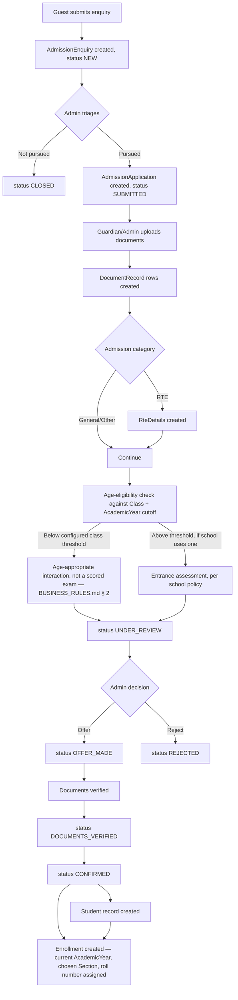
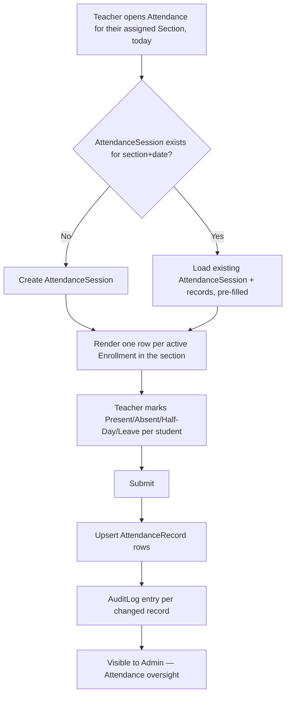
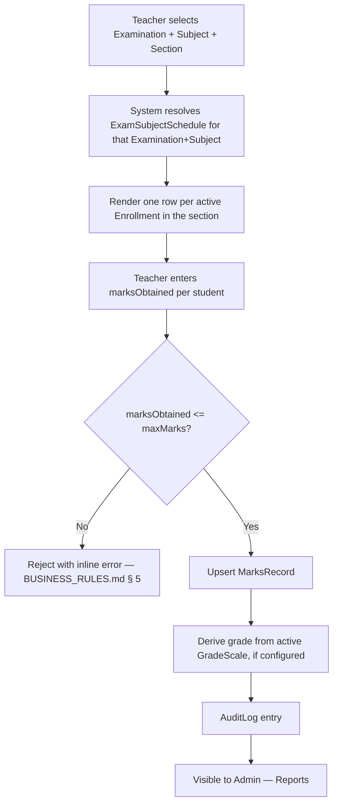
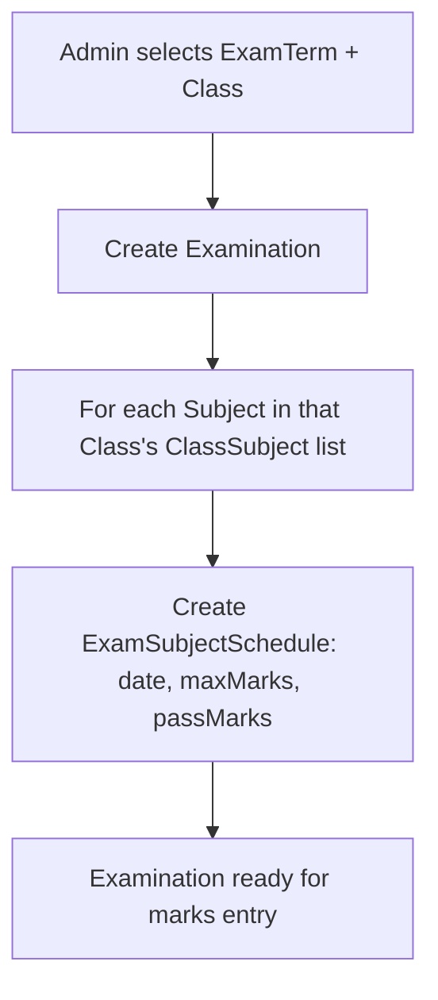
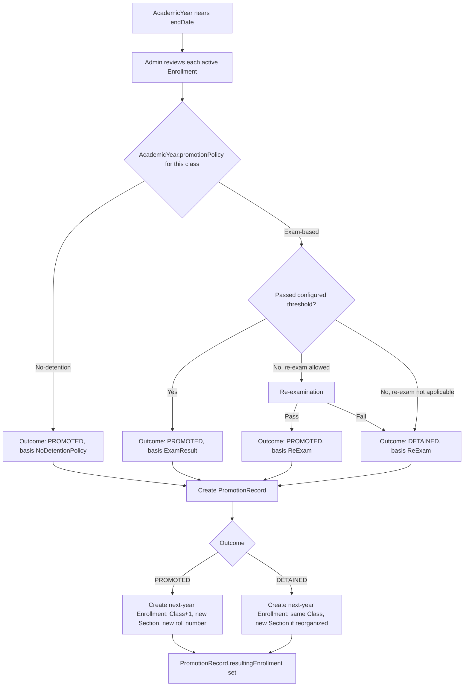
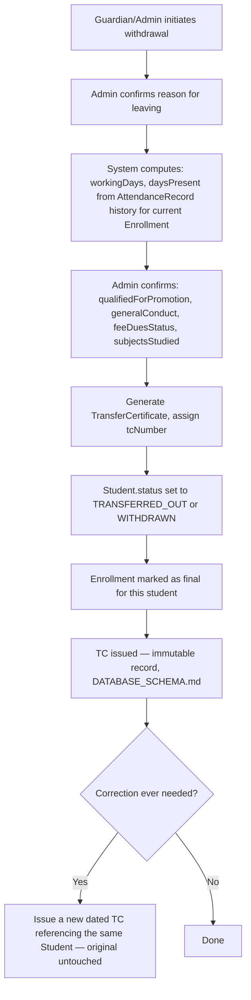
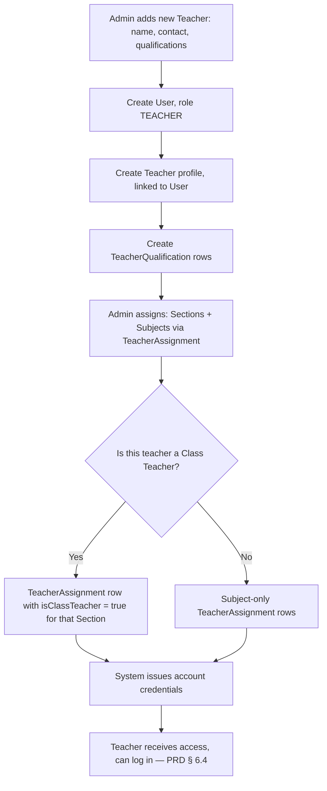
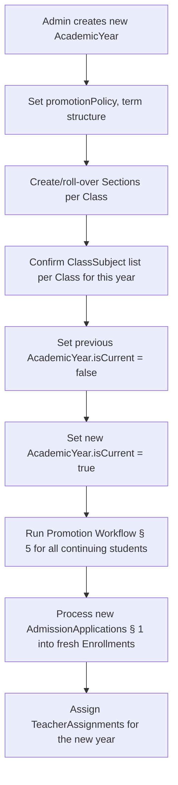

# Workflows

**Purpose:** The actual step-by-step processes the entities in [DOMAIN_MODEL.md](./DOMAIN_MODEL.md) exist to support. Where [PRODUCT_REQUIREMENTS.md § 6](../PRODUCT_REQUIREMENTS.md#6-user-journeys) already documents a user journey at the product level, this document goes one level deeper — which entity changes state at each step.

---

## 1. Admission Workflow

**Key rule callouts:** age-eligibility cutoffs and whether an entrance assessment exists at all are school/state-configurable, not fixed — see [BUSINESS_RULES.md § 2](./BUSINESS_RULES.md#2-admission-eligibility). RTE-category applications cannot reach `CONFIRMED` without a linked `RteDetails` — see [BUSINESS_RULES.md § 3](./BUSINESS_RULES.md#3-admission-categories--rte-quota).

---

## 2. Daily Attendance Workflow

Matches [PRD's acceptance criteria](../PRODUCT_REQUIREMENTS.md#7-acceptance-criteria-representative-examples) directly: only the assigned section's students are listed; reopening a marked day pre-fills and allows editing, not re-creation.

---

## 3. Marks Entry Workflow

---

## 4. Examination Setup Workflow (Admin, precedes § 3)

---

## 5. Promotion Workflow (End of Academic Year)

**Key rule callout:** which branch applies (`No-detention` vs. `Exam-based`) is entirely `AcademicYear.promotionPolicy`-driven, per [BUSINESS_RULES.md § 6](./BUSINESS_RULES.md#6-promotion--detention-policy) — this diagram shows the shape of the decision, not a fixed national or Rajasthan-specific rule.

---

## 6. Transfer / Withdrawal Workflow

---

## 7. Teacher Onboarding Workflow

---

## 8. Academic Structure Setup Workflow (Start of Each Academic Year)

This is the one workflow that touches nearly every bounded context in [DOMAIN_MODEL.md § 2](./DOMAIN_MODEL.md#2-bounded-contexts) — worth Epic B treating as its own late-stage milestone once a full year's data exists to roll over, not something to build speculatively before there's a real first year to conclude.
