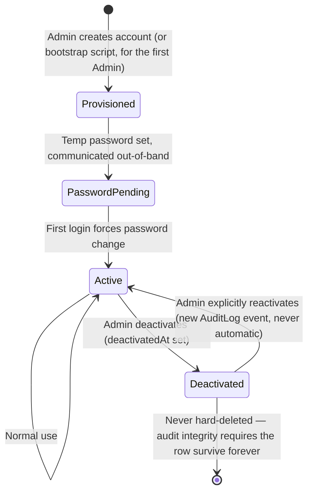

# Administration Strategy — User, Password, and Role Lifecycle

**Purpose:** The complete design for [Epic B — Administration](./EPIC_ROADMAP.md#epic-b--administration), covering every stage a `User` row passes through from creation to deactivation. **This is a design document — nothing here is implemented.** Grounded entirely in decisions already recorded: `Role` as a lookup table with `accessLevel` ([D-028](../DECISIONS.md#d-028--sprint-1-identity-foundation-role-as-a-lookup-table-with-accesslevel-user-merges-authjss-adapter-shape-repositoryservice-layer-introduced)), Credentials-only auth confirmed correct for V1 ([D-029](../DECISIONS.md#d-029--final-identity-architecture-review-validators-consolidated-into-libvalidations-roleiduseraccesslevel-design-affirmed)'s rejected-alternatives note), and no public self-registration under any circumstance ([D-001](../DECISIONS.md#d-001--three-roles-only-for-version-1)).

---

## 1. The Core Constraint: Nobody Self-Registers, Ever

Every `User` row in this system, for every client, forever, is created by an Admin action or the one-time bootstrap script — never by the person who will use the account. This is not a V1 limitation to be lifted later; it is a permanent product decision, because a school's staff roster is a fact the school's office controls, not something a stranger with an email address should be able to add themselves to. Auth.js's `Account`/`VerificationToken` tables exist in the schema (Sprint 1) for **future password-reset and OAuth-linking flows**, not for self-registration — a distinction worth stating precisely so a future implementer doesn't mistake "the adapter tables exist" for "self-registration is planned."

## 2. User Lifecycle

### 2.1 Provisioning

An Admin (or the bootstrap script, for the very first account) creates a `User` row with: `name`, `email`, `roleId`, and an initial password. Two provisioning shapes, not one:

- **Bootstrap Admin** (once per client deployment): created by a dedicated script run against the freshly-migrated database, not through the running application — see § 5. Never reachable via any HTTP route.
- **Every subsequent account** (Administrators, Principals, Teachers): created by an already-authenticated Admin through the Admin console, per [WORKFLOWS.md § 7](../domain/WORKFLOWS.md#7-teacher-onboarding-workflow)'s already-documented Teacher onboarding shape — `registerTeacher()` already implements the `User`+`Teacher`+`TeacherQualification` transaction (Sprint 4); a parallel `registerAdmin()`-shaped operation (no `Teacher` profile, just `User`) is the remaining piece for non-Teacher accounts.

### 2.2 Password Lifecycle

| Concern                        | Recommendation                                                                                                                                                                                                                                                                                                                                                                                              |
| ------------------------------ | ----------------------------------------------------------------------------------------------------------------------------------------------------------------------------------------------------------------------------------------------------------------------------------------------------------------------------------------------------------------------------------------------------------- |
| Hashing algorithm              | Argon2id — already the project's permanent architectural decision, carried into this epic unchanged.                                                                                                                                                                                                                                                                                                        |
| Initial password               | Admin sets it directly at provisioning time (simplest, matches how this school already operates — an office staff member telling a new teacher their login in person), **not** emailed or SMS'd — no notification provider is wired yet ([PRODUCT_VISION.md § 9](../PRODUCT_VISION.md#9-future-expansion) lists this as future).                                                                            |
| First-login behavior           | Force a password change on first login. This is the "activation" gesture in a system with no email-verification step — the user proves they received the credential by successfully changing it.                                                                                                                                                                                                            |
| Complexity requirements        | A reasonable minimum (length ≥ 8, not a byzantine ruleset) — per [PROJECT_GUARDRAILS.md § G-4](../PROJECT_GUARDRAILS.md#1-the-core-guardrails) "UX over functionality," aggressive complexity rules frustrate non-technical users more than they improve real-world security.                                                                                                                               |
| Periodic forced rotation       | **None.** Modern guidance (NIST 800-63B) recommends against mandatory periodic password expiry — it measurably pushes users toward weaker, more predictable passwords, not stronger ones. Explicitly not building this.                                                                                                                                                                                     |
| Self-service "forgot password" | **Deferred**, not V1-buildable without a notification provider (email/SMS) to deliver a reset link/code to. `VerificationToken` already exists in the schema specifically for this, per [D-029](../DECISIONS.md#d-029--final-identity-architecture-review-validators-consolidated-into-libvalidations-roleiduseraccesslevel-design-affirmed)'s own note ("plausibly needed for password reset regardless"). |
| V1 password reset mechanism    | **Admin-mediated.** A locked-out Teacher contacts the school office (the same WhatsApp/phone channel [PRODUCT_VISION.md](../PRODUCT_VISION.md) already describes as this school's real workflow); Admin sets a new temp password through the same provisioning UI, forcing another first-login change. No new mechanism needed — reuses provisioning's own "set temp password, force change" shape.         |

### 2.3 Account Activation

There is no separate "pending verification" state. A provisioned account is immediately capable of logging in with its temp password — "activation" is entirely the first-login forced password change, not a distinct workflow step or an email confirmation link. This is a deliberate simplification, not an oversight: email-based activation requires infrastructure (a transactional email provider) this product doesn't have yet, and the Admin-provisioned trust model already establishes that the account is legitimate the moment it's created (an Admin, not a stranger, vouched for it).

### 2.4 Role Assignment

- One role per user (`User.roleId`, single FK) — already built, already affirmed correct over a many-to-many model ([D-029](../DECISIONS.md#d-029--final-identity-architecture-review-validators-consolidated-into-libvalidations-roleiduseraccesslevel-design-affirmed)).
- An Admin can change **another** user's role, never their **own** — [PERMISSION_MATRIX.md § 2](../domain/PERMISSION_MATRIX.md#2-people--identity) already specifies this exact scope ("CRUD (not own role)"). This isn't a new rule; it's an existing permission-matrix entry this epic must actually implement, not redesign. The reason it matters operationally: it prevents an Admin from accidentally locking themselves out of Admin-tier access, and prevents a compromised Admin session from silently self-escalating past what it already had.
- Reassigning a Teacher to Admin (or vice versa) is a real, audited event (`AuditLog`, `action: UPDATE`, `beforeValue`/`afterValue` on `roleId`) — not a special case; the existing `writeAuditLog()` pattern already covers it.

### 2.5 Account Deactivation

- Soft only — `User.deactivatedAt`, never a hard delete, per [SOFT_DELETE_STRATEGY.md § 1](../database/SOFT_DELETE_STRATEGY.md#1-three-categories-not-two)'s "lifecycle-state entities" category. A deactivated Admin/Teacher must remain identifiable forever as the actor on every historical `AuditLog`/`AttendanceRecord`/`MarksRecord` row they touched.
- Deactivation does **not** cascade to a deactivated Teacher's `TeacherAssignment` rows — already established in [SOFT_DELETE_STRATEGY.md § 4](../database/SOFT_DELETE_STRATEGY.md#4-cascade-behavior-on-soft-delete): "who taught Section 6-A in 2024" must stay answerable regardless of current employment status. Live access is denied by checking `User.deactivatedAt IS NULL` at the permission-check layer, not by mutating historical assignment rows.
- Reactivation is **never automatic** — [SOFT_DELETE_STRATEGY.md § 5](../database/SOFT_DELETE_STRATEGY.md#5-never-restore) is explicit: "the only supported path back to active is a new, explicit Admin action," producing its own `AuditLog` row (`deactivated on X, reactivated on Y` as two distinct, traceable events), not a single mutable flag whose history is invisible.

## 3. Future Extensibility — Named, Not Designed

Per this project's own established discipline ([PROJECT_VISION.md § 9](../PRODUCT_VISION.md#9-future-expansion)'s pattern — name the seam, don't build ahead of real need):

| Future capability                          | The seam that already exists for it                                                                                                                                                                                       |
| ------------------------------------------ | ------------------------------------------------------------------------------------------------------------------------------------------------------------------------------------------------------------------------- |
| Self-service password reset (email/SMS)    | `VerificationToken` table (Sprint 1) — unused until a notification provider is chosen                                                                                                                                     |
| OAuth / SSO login (e.g., Google Workspace) | `Account` table (Sprint 1, Auth.js adapter shape) — unused until a provider is configured                                                                                                                                 |
| Parent/Student login                       | `AccessLevel`/`Role` enum is the seam — adding a value is cheap; the surfaces behind it are not built ([D-001](../DECISIONS.md#d-001--three-roles-only-for-version-1))                                                    |
| Multi-factor authentication                | Not seamed yet — would need its own scoped decision, no existing schema anticipates it                                                                                                                                    |
| Bulk account provisioning                  | Belongs to [Epic D — Data Migration Engine](./EPIC_ROADMAP.md#epic-d--data-migration-engine-import-engine), not this epic — a Teacher-import row already implies a `User`+`Teacher` creation, reusing `registerTeacher()` |

None of these are commitments — each needs its own scoped decision when a real need arrives, per [PROJECT_GUARDRAILS.md § Module Approval Process](../PROJECT_GUARDRAILS.md#2-module-approval-process) for anything that would add a role, and ordinary implementation-task scoping for the rest.

## 4. Permission Model Recap (Not New — Already Decided)

[PERMISSION_MATRIX.md § 2](../domain/PERMISSION_MATRIX.md#2-people--identity) already specifies the complete `User`/`Teacher` access matrix this epic implements, not redesigns:

| Entity  | Admin               | Teacher               |
| ------- | ------------------- | --------------------- |
| User    | CRUD (not own role) | RU (own row only)     |
| Teacher | CRUD                | RU (own profile only) |

Server-side enforcement only, per [ARCHITECTURE.md § 7](../ARCHITECTURE.md#7-security-principles) — every scoped restriction above is a query/mutation-layer filter, never a UI-hiding trick.

## 5. Bootstrap Admin — The One Account Nobody "Creates" Through the App

Because there is no self-registration and every subsequent account requires an already-logged-in Admin, the very first account for a new client deployment cannot come from the running application at all — it has to be created directly against the database, once, during deployment.

- **Mechanism:** A dedicated script (`pnpm run bootstrap:admin` or equivalent), run manually by whoever is deploying the client (TechPulse, per the [Client Implementation Playbook](./CLIENT_IMPLEMENTATION_PLAYBOOK.md)) — never an HTTP route, never reachable from the public internet.
- **Inputs:** Read from environment variables at run time (`BOOTSTRAP_ADMIN_EMAIL`, `BOOTSTRAP_ADMIN_NAME`, and either a `BOOTSTRAP_ADMIN_PASSWORD` or a generated one printed once to the deploy console) — never hardcoded, never committed.
- **Idempotency:** Must check for an existing Admin-tier `User` before creating another — safe to run twice by accident, never creates a duplicate bootstrap account. Mirrors the same idempotency discipline every seed script in this project already follows (`findX` before `createX`, Sprints 0–5).
- **Reuses the existing role seed:** `Role` rows ("Administrator"/"Principal"/"Teacher") are already seeded by `prisma/seed.ts` — the bootstrap script only needs to resolve the "Administrator" role and create one `User` row against it, the smallest possible operation, not a parallel identity system.
- **Post-bootstrap:** The very first thing the Bootstrap Admin should do on first login is change their own password (§ 2.2) and, per [Go-Live Checklist](./GO_LIVE_CHECKLIST.md), create the school's real named Administrators/Principal accounts — the bootstrap account is a deployment tool, not necessarily the account a real person uses day to day.
