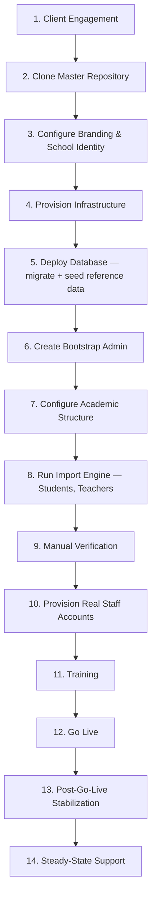

# Client Implementation Playbook

**Purpose:** The complete, corrected operational sequence for taking one new school from "signed client" to "live and supported," under the clone-per-client model — see [FRAMEWORK_STRATEGY.md](./FRAMEWORK_STRATEGY.md) for why this is a clone, not a tenant onboarding. **This is a process document, not an implementation** — [Epic H — Deployment & Go-Live](./EPIC_ROADMAP.md#epic-h--deployment--go-live) is what builds the tooling this playbook assumes exists (the bootstrap script, the Import Engine).

---

## 1. The Proposed Sequence Had a Real Ordering Bug

The originally proposed flow —

```
New Client → Clone Master Repository → Configure Branding → Configure School →
Create Bootstrap Admin → Deploy Database → Run Import Engine →
Manual Verification → Training → Go Live → Support
```

— places **Create Bootstrap Admin before Deploy Database**. This doesn't work: a Bootstrap Admin is a `User` row, and a `User` row cannot exist before the database schema it lives in has been migrated. This isn't a stylistic preference, it's a hard sequencing dependency, and it's corrected below along with three missing-but-necessary steps the original sequence skipped: infrastructure provisioning (implied but never named), account provisioning for the school's _real_ staff (distinct from the one bootstrap account), and a distinct post-go-live stabilization window (folded into "Support" in the original, but a materially different activity than steady-state support).

## 2. The Corrected Sequence



### 2.1 Stage by stage

1. **Client Engagement** — scoping conversation: which epics does this client need at go-live (per [EPIC_ROADMAP.md § 4](./EPIC_ROADMAP.md#4-epic-breakdown)'s per-epic Go-Live Readiness column — e.g., is Admission Management needed if their admission cycle already closed this year?), confirmed school identity facts, confirmed the client has (or will produce) an exportable spreadsheet of existing students/teachers. Named explicitly because "New Client" alone skips the step that determines everything downstream.
2. **Clone Master Repository** — `git clone` this repository into a new, client-named repository; add the master as an `upstream` remote (not deleted — see [VERSIONING_STRATEGY.md](./VERSIONING_STRATEGY.md) for why future framework updates depend on this remote still existing).
3. **Configure Branding & School Identity** — follow [CLIENT_CUSTOMIZATION_GUIDE.md](./CLIENT_CUSTOMIZATION_GUIDE.md) literally: `src/config/*.ts`, theme tokens, content pages. A code change, committed to the client repo — happens before deployment because it's part of the same build, not a runtime toggle.
4. **Provision Infrastructure** — hosting (Vercel per [PROJECT_CONTEXT.md § 8](../PROJECT_CONTEXT.md#8-tech-stack)), a Postgres database instance (Neon, matching the existing pattern), environment variables and secrets (`DATABASE_URL`, `DIRECT_URL`, `AUTH_SECRET`, `BOOTSTRAP_ADMIN_*` — never committed to the repo, per [DEVELOPMENT_CONVENTIONS.md § 10](../DEVELOPMENT_CONVENTIONS.md#10-environment-variables)). Named explicitly because it was previously implicit inside "Deploy Database."
5. **Deploy Database** — `prisma migrate deploy` against the new instance, then run the **reference-data-only** portion of seeding (`Role` rows — "Administrator"/"Principal"/"Teacher" — and the one `School`/`AcademicYear` row from step 3's configured values). Explicitly **not** the generic sample Student/Teacher/Attendance data Sprints 0–5's `prisma/seed.ts` currently includes — that data is this repository's own development fixture, not something a real client's database should ever contain. See [Go-Live Checklist § Data Integrity](./GO_LIVE_CHECKLIST.md#3-data-integrity) for the explicit check this implies.
6. **Create Bootstrap Admin** — now valid, since the schema exists. Run the bootstrap script (§ [ADMINISTRATION_STRATEGY.md § 5](./ADMINISTRATION_STRATEGY.md#5-bootstrap-admin--the-one-account-nobody-creates-through-the-app)) directly against the deployed database.
7. **Configure Academic Structure** — the Bootstrap Admin's first real action: either manually creates the school's actual classes/sections/subjects, or runs the Import Engine's Academic Structure import type first (§ [IMPORT_ENGINE_STRATEGY.md § 2.6](./IMPORT_ENGINE_STRATEGY.md#26-audit--two-layers-not-one)). Named as its own step because Student import (step 8) structurally depends on sections already existing to enroll into.
8. **Run Import Engine** — Students and Teachers, per [IMPORT_ENGINE_STRATEGY.md](./IMPORT_ENGINE_STRATEGY.md)'s Upload → Map → Validate → Preview → Commit pipeline.
9. **Manual Verification** — Admin and TechPulse jointly sample-check imported records against the client's original source (spot-check admission numbers, spellings, section assignments) — not "trust the import succeeded," an actual comparison against ground truth.
10. **Provision Real Staff Accounts** — the Bootstrap Admin creates the school's actual named Administrator/Principal/Teacher accounts (§ [ADMINISTRATION_STRATEGY.md § 2.1](./ADMINISTRATION_STRATEGY.md#21-provisioning)). Named as its own step, distinct from step 6, because the bootstrap account is a deployment tool — it is not necessarily an account any real staff member should keep using day to day.
11. **Training** — now trains staff on **their own real accounts and their own real data** (imported in step 8), not a generic demo — materially more effective, and only possible because steps 6–10 already happened.
12. **Go Live** — DNS cutover / production traffic switch; the point at which the school's actual families and staff start using the live system.
13. **Post-Go-Live Stabilization** — a defined, heightened-attention window (recommend: two weeks) where TechPulse actively watches for issues rather than waiting for a support ticket — named separately from steady-state support because the failure modes right after go-live (a training gap surfacing, an edge case the import didn't catch) are different from ordinary steady-state issues.
14. **Steady-State Support** — ongoing, per whatever support agreement governs the engagement; out of this playbook's scope to design further (a business/contractual concern, not a technical one).

## 3. What Changed From the Original, and Why

| Original step                                     | Correction                                                                                                             |
| ------------------------------------------------- | ---------------------------------------------------------------------------------------------------------------------- |
| "New Client"                                      | Split into an explicit Client Engagement step — determines scope, not just a label                                     |
| (implicit)                                        | Added "Provision Infrastructure" as its own step — was silently folded into "Deploy Database" before                   |
| "Create Bootstrap Admin" before "Deploy Database" | **Reordered after** Deploy Database — a hard sequencing fix, not a preference                                          |
| (implicit)                                        | Added "Configure Academic Structure" between database deploy and Import Engine — students need sections to enroll into |
| (implicit)                                        | Added "Provision Real Staff Accounts" as its own step, distinct from Bootstrap Admin creation                          |
| "Support"                                         | Split into "Post-Go-Live Stabilization" (a defined window) and "Steady-State Support" (ongoing) — different activities |

## 4. Repeatability Check

Every step above is either (a) already-built and reused as-is (deployment tooling, migrations), (b) newly designed in this planning sprint ([Administration Strategy](./ADMINISTRATION_STRATEGY.md), [Import Engine Strategy](./IMPORT_ENGINE_STRATEGY.md)), or (c) purely a documented process step with no code dependency (Training, Client Engagement). Nothing in this sequence requires a bespoke one-off engineering effort per client — that is the entire point of formalizing it now, before a second real client is actually being onboarded.
